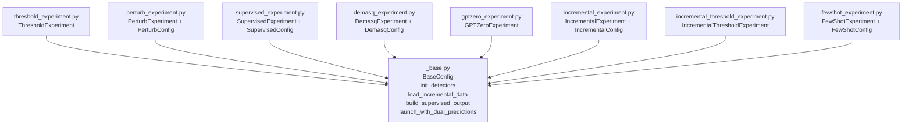

# experiment 模块重构文档

> **重构范围**：`mgtbench/experiment/` 目录
> **重构日期**：2026-03-14
> **重构目标**：将 881 行的单文件 `experiment.py` 拆分为 9 个职责单一的独立模块，消除代码冗余，修复已知 bug。

---

## 一、重构前的问题

### 1.1 文件结构

```
mgtbench/experiment/
├── __init__.py        # 从 experiment.py 导入所有类
└── experiment.py      # 881 行，包含 8 个实验类 + 4 个 Config 类
```

### 1.2 主要问题

| 问题类型     | 具体表现                                                                                           |
| ------------ | -------------------------------------------------------------------------------------------------- |
| **代码冗余** | `ThresholdExperiment.launch` 与 `PerturbExperiment.launch` 几乎相同                                |
| **代码冗余** | 8 个实验类的 `__init__` 重复同一段 detector 包装/校验逻辑                                          |
| **代码冗余** | 3 个增量类（Incremental、IncrementalThreshold、FewShot）的 `load_data` 完全相同                    |
| **代码冗余** | 2 个增量类（Incremental、FewShot）的 `return_output` 高度相似                                      |
| **代码冗余** | 5 个 Config 类的 `update` 方法完全相同                                                             |
| **Bug**      | `GPTZeroExperiment.__init__` 中 `isinstance(detector, DemasqDetector)` 应为 `GPTZeroDetector`      |
| **Bug**      | `FewShotExperiment.__init__` 中 `isinstance(detector, IncrementalDetector)` 应为 `FewShotDetector` |
| **可维护性** | 单文件 881 行，定位和修改困难                                                                      |

---

## 二、重构后的文件结构

```
mgtbench/experiment/
├── __init__.py                          # re-export 层，对外接口不变
├── _base.py                             # 公共工具函数 + BaseConfig 基类
├── threshold_experiment.py              # ThresholdExperiment
├── perturb_experiment.py                # PerturbConfig + PerturbExperiment
├── supervised_experiment.py             # SupervisedConfig + SupervisedExperiment
├── demasq_experiment.py                 # DemasqConfig + DemasqExperiment
├── gptzero_experiment.py                # GPTZeroExperiment
├── incremental_experiment.py            # IncrementalConfig + IncrementalExperiment
├── incremental_threshold_experiment.py  # IncrementalThresholdExperiment
└── fewshot_experiment.py                # FewShotConfig + FewShotExperiment
```

> 原 `experiment.py` 已删除。

---

## 三、各优化项详解

### 3.1 `launch` 方法去重

**涉及文件**：`_base.py`、`threshold_experiment.py`、`perturb_experiment.py`

**问题**：`ThresholdExperiment.launch` 和 `PerturbExperiment.launch` 逻辑几乎一致——都需要处理"双预测（threshold + logistic）"和"单预测（logistic only）"两种格式。

**方案**：在 `_base.py` 中新增 `launch_with_dual_predictions(experiment, **config)` 工具函数。它通过检测 `train_pred` 的数据结构（`len == 2` 且内部元素为 tuple 时是双预测）自动区分两种格式，生成对应的 `DetectOutput` 对象。

两个实验类的 `launch` 方法简化为一行调用：

```python
def launch(self, **config):
    return launch_with_dual_predictions(self, **config)
```

> **不修改 `BaseExperiment.launch`**，因为 Supervised、Demasq 等实验类的预测格式不同，强行统一反而增加复杂度。

---

### 3.2 统一 `__init__` 初始化模式

**涉及文件**：`_base.py` + **全部 8 个实验类文件**

**问题**：所有实验类的 `__init__` 都重复同一段逻辑：

```python
self.detector = [detector] if isinstance(detector, XxxDetector) else detector
if not self.detector:
    raise ValueError("You should pass a list of detector to an experiment")
```

**方案**：在 `_base.py` 中新增 `init_detectors(detector, detector_class)` 函数，返回经过包装和校验的 detector 列表。各实验类简化为：

```python
self.detector = init_detectors(detector, MetricBasedDetector)
```

---

### 3.3 `load_data` 去重

**涉及文件**：`_base.py`、`incremental_experiment.py`、`incremental_threshold_experiment.py`、`fewshot_experiment.py`

**问题**：三个增量学习类的 `load_data` 完全相同——都是取 `data["train"][-1]` 作为标准训练/测试集。

**方案**：在 `_base.py` 中新增 `load_incremental_data(experiment, data)` 函数。三个类的 `load_data` 简化为：

```python
def load_data(self, data):
    load_incremental_data(self, data)
```

---

### 3.4 `return_output` 去重

**涉及文件**：`_base.py`、`incremental_experiment.py`、`fewshot_experiment.py`

**问题**：两个类的 `return_output` 方法逻辑高度相似，仅获取 `num_labels` 的属性路径不同：

- `IncrementalExperiment`：`detector.model.pretrained.num_labels`
- `FewShotExperiment`：`detector.model.num_labels`

**方案**：在 `_base.py` 中新增 `build_supervised_output(experiment, num_labels, pair, intermedia)` 函数，将 `num_labels` 作为参数传入，不再依赖特定的属性路径。各类的 `return_output` 负责获取正确的 `num_labels` 并调用此函数。

---

### 3.5 Bug 修复

#### GPTZeroExperiment

**文件**：`gptzero_experiment.py`

```diff
-from ..methods import DemasqDetector
+from ..methods import GPTZeroDetector

 class GPTZeroExperiment(BaseExperiment):
     def __init__(self, detector, **kargs) -> None:
         super().__init__()
-        self.detector = [detector] if isinstance(detector, DemasqDetector) else detector
+        self.detector = init_detectors(detector, GPTZeroDetector)
```

**原因**：原代码中 `isinstance` 检查使用了 `DemasqDetector`，这是从 `DemasqExperiment` 复制粘贴时遗留的 bug。`GPTZero` 检测器的实际类是 `GPTZeroDetector`。

#### FewShotExperiment

**文件**：`fewshot_experiment.py`

```diff
-from ..methods import IncrementalDetector
+from ..methods import FewShotDetector

 class FewShotExperiment(BaseExperiment):
     def __init__(self, detector, **kargs) -> None:
         super().__init__()
-        self.detector = [detector] if isinstance(detector, IncrementalDetector) else detector
+        self.detector = init_detectors(detector, FewShotDetector)
```

**原因**：FewShot 检测器（`BaselineDetector`、`GenerateDetector`、`RNDetector`）继承自 `FewShotDetector`，而非 `IncrementalDetector`。

---

### 3.6 Config 类统一

**涉及文件**：`_base.py` + 所有含 Config 的子模块

**问题**：5 个 Config 数据类（`PerturbConfig`、`SupervisedConfig`、`DemasqConfig`、`IncrementalConfig`、`FewShotConfig`）的 `update` 方法完全相同。

**方案**：所有 Config 类继承自 `_base.py` 中的 `BaseConfig`，后者提供统一的 `update` 方法。各 Config 类不再需要自行定义 `update`。

---

## 四、`_base.py` 工具函数一览

| 函数                             | 用途                       | 使用者                                     |
| -------------------------------- | -------------------------- | ------------------------------------------ |
| `BaseConfig.update()`            | 从字典更新 dataclass 字段  | 5 个 Config 子类                           |
| `init_detectors()`               | detector 列表包装 + 校验   | 全部 8 个实验类                            |
| `load_incremental_data()`        | 增量数据加载（取最后阶段） | Incremental、IncrementalThreshold、FewShot |
| `build_supervised_output()`      | 有监督预测输出构造         | Incremental、FewShot                       |
| `launch_with_dual_predictions()` | 双预测格式的 launch 逻辑   | Threshold、Perturb                         |

---

## 五、接口兼容性

| 组件          | 是否需要修改 | 说明                                                                                                            |
| ------------- | ------------ | --------------------------------------------------------------------------------------------------------------- |
| `__init__.py` | 已修改       | 从各子模块 re-export，对外 API 不变                                                                             |
| `auto.py`     | **不需要**   | 动态导入路径 `mgtbench.experiment.XxxExperiment` 通过 `__init__.py` re-export 自动生效                          |
| `run/*.py`    | **不需要**   | 所有脚本通过 `AutoExperiment.from_experiment_name()` 或 `from mgtbench.experiment import SupervisedConfig` 调用 |

---

## 六、各实验类的依赖关系



> 各实验类之间**零耦合**，仅共同依赖 `_base.py` 和 `BaseExperiment`（来自 `auto.py`）。
