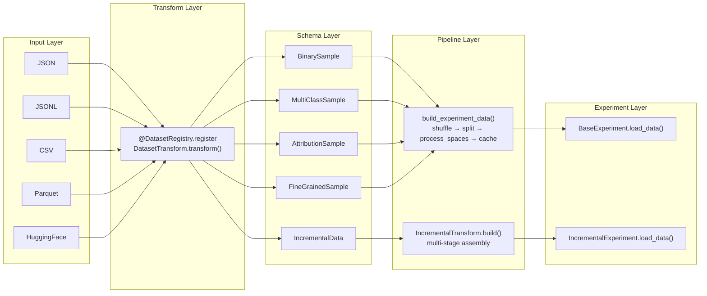
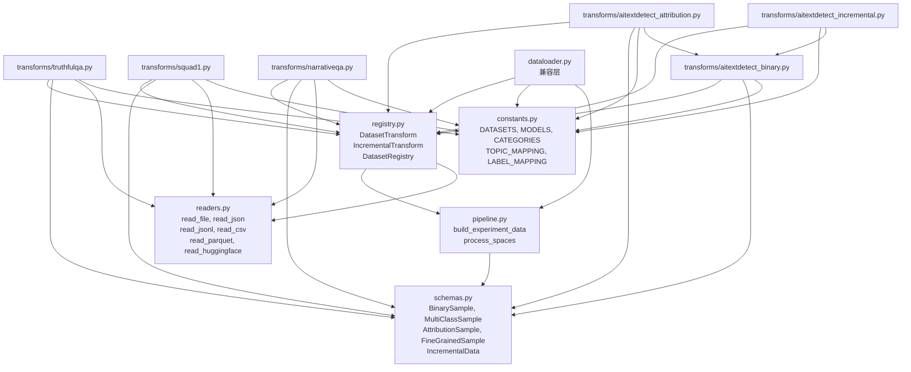

# 数据加载模块 Schema 化重构文档

> **重构范围**：`easymgtd/loading/` 目录
> **重构日期**：2026-05-20
> **重构目标**：将 944 行的单体 `dataloader.py` 拆分为 Schema + Transform + Registry 架构，消除代码重复，支持多格式输入，降低新数据集接入成本。

---

## 一、重构前的问题

### 1.1 文件结构

```
easymgtd/loading/
├── __init__.py               # 导出 model_loader + dataloader 函数
├── dataloader.py             # 944 行，包含全部数据加载/处理逻辑
├── dataloader_attribution.py # 338 行，旧模型组 attribution（死代码）
└── model_loader.py           # 模型加载工具（不涉及本次重构）
```

### 1.2 主要问题

| 问题类型     | 具体表现                                                                                                          |
| ------------ | ----------------------------------------------------------------------------------------------------------------- |
| **代码冗余** | `process_spaces()` 在 `dataloader.py` 和 `dataloader_attribution.py` 中各实现一次，逻辑相同                        |
| **代码冗余** | `load_TruthfulQA`/`load_SQuAD1`/`load_NarrativeQA` 三个函数结构高度相似，仅列名和过滤条件不同                      |
| **代码冗余** | `_build_split_and_save` 的 split/shuffle/save 逻辑被 `load_subject_data`/`load_topic_data` 各自内联实现             |
| **死代码**   | `dataloader_attribution.py` 在整个项目中未被任何模块或脚本导入（grep 验证）                                         |
| **死代码**   | Essay/Reuters/WP 数据集 (`load_old_data`) 在 `run/` 脚本中未被使用                                                 |
| **命名混淆** | `detectLLM` 参数名容易与"检测器方法"混淆，实际含义是"被检测的目标 LLM"                                              |
| **可扩展性** | 新增数据集需手写完整的 `load_*` 函数，包含大量重复的 split/shuffle/save 样板代码                                    |
| **格式限制** | 仅支持 CSV/JSON 文件和 HuggingFace Dataset，无统一的多格式读取接口                                                  |
| **可维护性** | 单文件 944 行，二分类/多分类/归因/增量四种数据格式的逻辑混杂在一起                                                   |

---

## 二、重构后的文件结构

```
easymgtd/loading/
├── __init__.py                          # re-export 层，触发 transform 注册
├── model_loader.py                      # 不变
├── schemas.py                           # 5 种 Schema 数据类定义
├── readers.py                           # 多格式文件读取器
├── constants.py                         # 集中管理常量
├── registry.py                          # Transform 基类 + DatasetRegistry
├── pipeline.py                          # 通用 split/shuffle/cache pipeline
├── dataloader.py                        # 精简为兼容层（~100 行）
└── transforms/
    ├── __init__.py                      # 触发所有 transform 注册
    ├── truthfulqa.py                    # TruthfulQA → BinarySample
    ├── squad1.py                        # SQuAD1 → BinarySample
    ├── narrativeqa.py                   # NarrativeQA → BinarySample
    ├── aitextdetect_binary.py           # AITextDetect → BinarySample
    ├── aitextdetect_attribution.py      # Attribution → AttributionSample
    └── aitextdetect_incremental.py      # Incremental → IncrementalData
```

> 原 `dataloader_attribution.py` 已删除。
> 原 `dataloader.py`（944 行）精简为兼容层（~100 行）。

### 已删除文件

| 文件 | 删除原因 |
|------|----------|
| `dataloader_attribution.py` | 死代码：全项目无导入。使用过时的模型列表（ChatGPT/ChatGLM/Dolly），功能已被 `aitextdetect_attribution.py` 取代 |
| `transforms/old_datasets.py` | Essay/Reuters/WP 在 `run/` 脚本中无使用，不迁移 |

---

## 三、架构设计

### 3.1 数据流



### 3.2 五种 Schema

| Schema | 数据类 | 核心字段 | label 语义 | 适用场景 |
|--------|--------|---------|-----------|---------|
| **Binary** | `BinarySample` | `text, label∈{0,1}` | 0=human, 1=machine | 标准二分类检测 |
| **MultiClass** | `MultiClassSample` | `text, label∈[0,N], category?` | 自定义语义 | 多分类、带元数据 |
| **Attribution** | `AttributionSample` | `text, label∈[0,N]` | 0=Human, 1..N=各 LLM | 源模型归属 |
| **FineGrained** | `FineGrainedSample` | `text, sentences, sentence_labels, label?` | 每句独立标注 | 句子级检测 |
| **Incremental** | `IncrementalData` | `train: [StageData], test: [StageData]` | 随 stage 增长 | 增量学习 |

### 3.3 注册 8 个数据集

| 注册名 | Transform 类 | 输出 Schema | 来源 |
|--------|-------------|------------|------|
| `TruthfulQA` | `TruthfulQATransform` | `BinarySample` | `dataloader.py` L171-192 |
| `SQuAD1` | `SQuAD1Transform` | `BinarySample` | `dataloader.py` L195-210 |
| `NarrativeQA` | `NarrativeQATransform` | `BinarySample` | `dataloader.py` L213-234 |
| `AITextDetect` | `AITextDetectBinaryTransform` | `BinarySample` | `dataloader.py` L388-460 |
| `AITextDetect_Attribution` | `AITextDetectAttributionTransform` | `AttributionSample` | `dataloader.py` L471-627 |
| `AITextDetect_Attribution_Topic` | `AITextDetectAttributionTopicTransform` | `AttributionSample` | `dataloader.py` L522-610 |
| `AITextDetect_Incremental` | `AITextDetectIncrementalTransform` | `IncrementalData` | `dataloader.py` L630-776 |
| `AITextDetect_Incremental_Topic` | `AITextDetectIncrementalTopicTransform` | `IncrementalData` | `dataloader.py` L779-943 |

---

## 四、各模块详解

### 4.1 `schemas.py` — Schema 数据类

定义 5 种 sample 级 Schema（`BinarySample`, `MultiClassSample`, `AttributionSample`, `FineGrainedSample`）和 3 种 dataset 级 Schema（`ExperimentData`, `FineGrainedExperimentData`, `IncrementalData`）。

所有 Schema 提供 `to_dict()` 方法，保证与下游 `BaseExperiment.load_data()` 期望的 dict 格式兼容。

**验证约束**：
- `BinarySample.label` 必须为 0 或 1（`__post_init__` 校验）
- `FineGrainedSample.sentences` 与 `sentence_labels` 长度必须一致

### 4.2 `readers.py` — 多格式文件读取器

统一接口 `read_file(path, format="auto") -> list[dict]`，支持：

| 格式 | 函数 | 依赖 |
|------|------|------|
| JSON | `read_json()` | 标准库 json |
| JSONL | `read_jsonl()` | 标准库 json |
| CSV | `read_csv()` | pandas |
| Parquet | `read_parquet()` | pandas |
| HuggingFace | `read_huggingface()` | datasets |

JSON reader 支持两种格式：数组格式 `[{...}, ...]` 和列式格式 `{"col1": [...], "col2": [...]}`（自动转换为行式）。

### 4.3 `constants.py` — 常量集中管理

从 `dataloader.py` 提取：

- 环境变量：`DATASET_AITextDetect`, `DATASET_DIR_OTHERS`, `SAVED_DATA_DIR`
- 数据集列表：`DATASETS`, `MODELS`, `CATEGORIES`, `TOPICS`
- 映射表：`TOPIC_MAPPING`, `LABEL_MAPPING`, `AITEXTDETECT_SOURCE_DICT`

### 4.4 `registry.py` — Transform 基类与注册表

两个基类：

- `DatasetTransform`：标准 transform，子类实现 `transform(raw_data, **kwargs) -> list[Sample]`
- `IncrementalTransform`：增量 transform，子类实现 `build(**kwargs) -> dict`

`DatasetRegistry` 提供：

```python
@DatasetRegistry.register("name")   # 装饰器注册
DatasetRegistry.list_datasets()      # 列出所有注册名
DatasetRegistry.load("name", **kw)   # 统一加载入口
```

`load()` 方法根据 transform 类型自动路由：
- `DatasetTransform` → 读取文件 → transform → `build_experiment_data()`
- `IncrementalTransform` → 直接调用 `build()`

### 4.5 `pipeline.py` — 通用 Pipeline

从 `dataloader.py` 的内联逻辑提取并统一：

| 函数 | 用途 |
|------|------|
| `process_spaces(text)` | 标点空格标准化（唯一实现，消除重复） |
| `build_experiment_data(samples, seed, split_ratio, cache_path)` | shuffle → split → process_spaces → save cache |
| `load_cache(path)` | 检查并加载 JSON 缓存 |
| `save_cache(data, path)` | 保存 JSON 缓存 |

`build_experiment_data()` 自动识别 `FineGrainedSample` 并在输出中包含 `sentences` 和 `sentence_labels` 字段。

### 4.6 `dataloader.py` — 兼容层

精简为 ~100 行的薄包装层，所有函数委托到 `DatasetRegistry.load()`：

| 兼容函数 | 委托目标 |
|---------|---------|
| `load(name, targetLLM, ...)` | `DatasetRegistry.load(name, ...)` |
| `load_topic_data(targetLLM, topic, ...)` | `DatasetRegistry.load("AITextDetect", ...)` |
| `load_subject_data(targetLLM, category, ...)` | `DatasetRegistry.load("AITextDetect", ...)` |
| `load_attribution(category, ...)` | `DatasetRegistry.load("AITextDetect_Attribution", ...)` |
| `load_attribution_topic(topic, ...)` | `DatasetRegistry.load("AITextDetect_Attribution_Topic", ...)` |
| `load_incremental(order, category, ...)` | `DatasetRegistry.load("AITextDetect_Incremental", ...)` |
| `load_incremental_topic(order, topic, ...)` | `DatasetRegistry.load("AITextDetect_Incremental_Topic", ...)` |

---

## 五、重要变更

### 5.1 `detectLLM` → `targetLLM`

全面清理参数命名：`detectLLM`（容易与检测器方法混淆）统一替换为 `targetLLM`（明确表示"被检测的目标 LLM"）。

**清理范围**：

| 层级 | 修改内容 |
|------|----------|
| `easymgtd/loading/dataloader.py` | 所有函数签名仅接受 `targetLLM`，不再兼容 `detectLLM` |
| `run/debug/_common.py` | `load_demo_data()` 签名和 `load()` 调用 |
| `run/debug/test_*.py` (21 个) | `load_demo_data(..., detectLLM=)` 和 `load(..., detectLLM=)` 调用 |
| `run/benchmark.py` | 9 处 `load(..., detectLLM=)` 调用 |
| `run/transfer_binary_zeroshot.py` | 2 处 `load_topic_data(detectLLM=)` 调用 |
| `run/transfer_binary_lmd.py` | 2 处 `load_topic_data(..., detectLLM=)` 调用 |
| `run/transfer_binary_mitigate_lmd.py` | 2 处 `load_topic_data(detectLLM=)` 调用 |

> **注意**：`run/` 脚本中作为局部变量名使用的 `detectLLM`（如循环变量、argparse 参数、日志输出）未修改，仅修改传给数据加载函数的**关键字参数名**。

### 5.2 删除死代码

- `dataloader_attribution.py`：全项目无导入，旧模型列表（ChatGPT/ChatGLM/Dolly/GPT4/StableLM/Claude）
- Essay/Reuters/WP 数据集的 transform：`run/` 脚本中未使用

### 5.3 修复 `seed` 参数重复传递 Bug

`dataloader.py` 兼容层中，`seed` 同时出现在 `kwargs` 字典和 `DatasetRegistry.load()` 的显式参数中，导致 `TypeError: got multiple values for keyword argument 'seed'`。

修复方式：`seed` 仅通过显式参数传递给 `DatasetRegistry.load()`，不再放入 `kwargs`。同时在 `registry.py` 中将 `seed` 注入 transform kwargs，确保需要 seed 的 transform（如 `AITextDetectBinaryTransform`）仍可通过 `kwargs.get("seed")` 获取。

---

## 六、接口兼容性

| 组件 | 是否需要修改 | 说明 |
|------|------------|------|
| `__init__.py` | 已修改 | 导出 `DatasetRegistry`, 各 Schema 类, 触发 transform 注册 |
| `dataloader.py` | 已修改 | 精简为兼容层，保留所有原有函数签名（参数名从 `detectLLM` 改为 `targetLLM`） |
| `run/debug/_common.py` | 已修改 | `load_demo_data()` 签名 + `load()` 调用改为 `targetLLM` |
| `run/debug/test_*.py` | 已修改 | 21 个脚本的 `detectLLM=` 关键字参数批量修复 |
| `run/benchmark.py` | 已修改 | 9 处 `load()` 调用修复 |
| `run/transfer_*.py` | 已修改 | `load_topic_data()` 调用修复（局部变量名未改，仅改关键字参数） |
| `experiment/*.py` | **不需要** | 数据消费端接口不变，仍接收 `{"train": {"text": [], "label": []}, "test": {...}}` |

---

## 七、模块依赖关系



> 各 transform 之间仅 `aitextdetect_attribution.py` 和 `aitextdetect_incremental.py` 依赖 `aitextdetect_binary.py`（复用 `load_aitextdetect_split()` 函数）。其余 transform 互相零耦合。

---

## 八、新数据集接入指南

新增数据集只需 3 步：

### 步骤 1：编写 Transform

```python
# easymgtd/loading/transforms/my_dataset.py
from ..registry import DatasetRegistry, DatasetTransform
from ..schemas import BinarySample

@DatasetRegistry.register("MyDataset")
class MyDatasetTransform(DatasetTransform):
    output_schema = BinarySample

    def transform(self, raw_data: list[dict], **kwargs) -> list[BinarySample]:
        targetLLM = kwargs["targetLLM"]
        samples = []
        for row in raw_data:
            samples.append(BinarySample(text=row["human_text"], label=0))
            samples.append(BinarySample(text=row[targetLLM], label=1))
        return samples
```

### 步骤 2：注册 Transform

在 `transforms/__init__.py` 中添加一行：

```python
from . import my_dataset
```

### 步骤 3：使用

```python
from easymgtd.loading import DatasetRegistry

data = DatasetRegistry.load(
    "MyDataset",
    path="path/to/data.jsonl",    # 支持 JSON/JSONL/CSV/Parquet
    targetLLM="gpt35",
    seed=3407,
    split_ratio=0.8,
)
```

---

## 九、验证结果

### 9.1 单元测试

- Schema 验证：`BinarySample` 拒绝无效 label、`FineGrainedSample` 拒绝长度不匹配 ✅
- Reader 格式推断：JSON/JSONL/CSV/Parquet 正确识别 ✅
- Pipeline：`process_spaces()` + `build_experiment_data()` 正确 split/shuffle ✅
- Registry：8 个数据集正确注册 ✅
- 兼容层：所有旧函数签名可导入 ✅

### 9.2 端到端测试

- `run/debug/test_ll.py`：使用 `mgtd` conda 环境，STEM 主题 + Moonshot LLM，1000 train + 1607 test 样本，完整推理通过 ✅

---

## 十、后续计划

1. ~~**更新 `run/` 脚本**~~（已完成）：所有脚本的 `detectLLM=` 关键字参数已修复为 `targetLLM=`
2. **更多端到端回归测试**：对其他 debug 脚本（test_detectgpt、test_entropy 等）逐一验证
3. **FineGrained 数据集示例**：创建一个使用 `FineGrainedSample` 的示例 transform
4. **`run/` 脚本局部变量重命名**：将脚本中残留的 `detectLLM` 局部变量名统一改为 `targetLLM`（非阻塞，纯代码风格改进）
